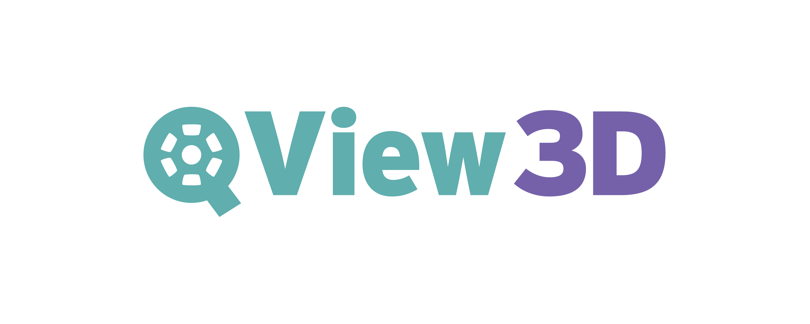

## Overview

QView3d, developed at SUNY's Hydra Lab, is an open-source software project designed to streamline the management and communication of 3D printing files to printer arrays. It offers users an expandable framework to enhance their workflow and take control of their process. Embracing an open community ethos, QView3d continuously evolves, actively seeking collaboration and feedback from users to improve and innovate.

## Development Team

- [**Lars Palombi** ](https://github.com/Lars-Codes)
- [**Jack Gusler**](https://github.com/jackgusler)
- [**Olamide Kumapayi**](https://github.com/olakuma)
- [**Michael Curry**](https://github.com/currymike123)

## Features

- **Concurrent Communication**: Manage multiple 3D printers simultaneously.
- **Job Management**:
  - Local storage of database.
  - Load balancing to distribute jobs across multiple printers.
  - Storage management for purging old files while retaining essential data.
  - Job prioritization and favoring.
  - Comprehensive job filtering and history tracking.
  - initiate printer pauses and filament color changes.
- **Error Logging**: Assign comments and track issues for past jobs to analyze job success and error rates.
- **Advanced Viewing**:
  - Real-time 3D model previews before and during printing.
  - Layer-by-layer virtual print monitoring via GCode Viewer.

## Technologies

- **Frontend**: Vue.js with Bootstrap for styling.
- **Backend**: Flask integrated with SQLite, handling data through Node.js.
- **Communication**: Serial communication via Python, CORS for middleware support.
- **Database**: SQLite.

## Setup and Installation

The software is currently designed to run on Ubuntu 20.04 LTS and later. MacOS and Windows are not fully supported but can be achieved with additional configuration.

Clone the repository:

```bash
git clone https://github.com/sunyhyralab/QView3D.git
```

### Run Locally:

Install:

```bash
./install.sh
```

Run:

```bash
./run.sh
```

## Pull Requests

We welcome contributions to QView3D. Please follow the guidelines in the [CONTRIBUTING.md](CONTRIBUTING.md) file.

## License

This project is licensed under the MIT License - see the [LICENSE.md](LICENSE.md) file for details.

## Version

0.1.0
